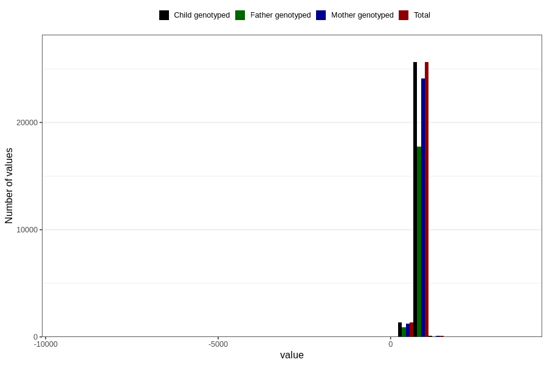

# age_2y
Variable mapping to `Q6_AGE_2_Y` in `Skjema6_3aar_v12`.
- Number of values:

| Value | Total | Child genotyped | Mother genotyped | Father genotyped |
| ----- | ----- | --------------- | ---------------- | ---------------- |
| Missing | 53744 | 53744 | 50534 | 34456 |
| Non-missing | 27062 | 27062 | 25490 | 18707 |
| 25th percentile | 734 | 734 | 734 | 734 |
| 50th percentile | 759 | 759 | 759 | 760 |
| 75th percentile | 806 | 806 | 806 | 808 |
| Mean | 767.880053211145 | 767.880053211145 | 767.688505296195 | 769.394504730849 |
| Standard deviation | 113.36694839529 | 113.36694839529 | 114.766058120484 | 92.201893510109 |
| N | 27062 | 27062 | 25490 | 18707 |

