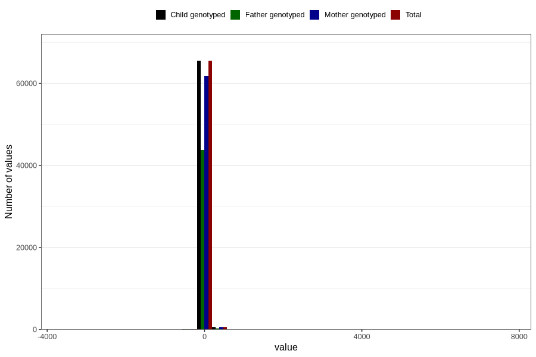

# age_3m
Variable mapping to `ALDER3MND_SJEKK` in `Skjema4_6mnd_v12`.
- Number of values:

| Value | Total | Child genotyped | Mother genotyped | Father genotyped |
| ----- | ----- | --------------- | ---------------- | ---------------- |
| Missing | 14595 | 14595 | 13608 | 8979 |
| Non-missing | 66211 | 66211 | 62416 | 44184 |
| 25th percentile | 90 | 90 | 90 | 90 |
| 50th percentile | 94 | 94 | 94 | 94 |
| 75th percentile | 99 | 99 | 99 | 98 |
| Mean | 95.8493452749543 | 95.8493452749543 | 95.891357985132 | 95.6970396523628 |
| Standard deviation | 62.3364610703994 | 62.3364610703994 | 62.8885600830662 | 65.0023892448311 |
| N | 66211 | 66211 | 62416 | 44184 |

