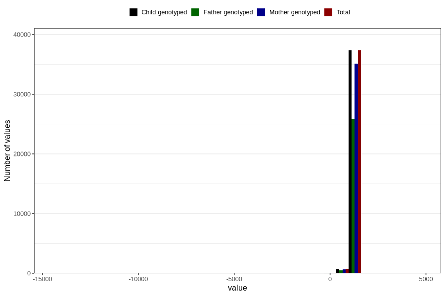

# age_3y
Variable mapping to `Q6_AGE_3_Y` in `Skjema6_3aar_v12`.
- Number of values:

| Value | Total | Child genotyped | Mother genotyped | Father genotyped |
| ----- | ----- | --------------- | ---------------- | ---------------- |
| Missing | 42653 | 42653 | 40161 | 26737 |
| Non-missing | 38153 | 38153 | 35863 | 26426 |
| 25th percentile | 1096 | 1096 | 1096 | 1096 |
| 50th percentile | 1103 | 1103 | 1103 | 1103 |
| 75th percentile | 1119 | 1119 | 1119 | 1119 |
| Mean | 1096.85930333132 | 1096.85930333132 | 1096.88221844241 | 1097.99439945508 |
| Standard deviation | 173.848749432633 | 173.848749432633 | 177.684716324544 | 154.597351725978 |
| N | 38153 | 38153 | 35863 | 26426 |

