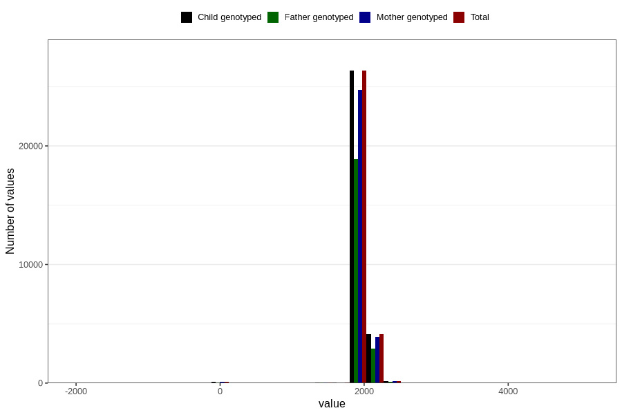

# age_5y
Variable mapping to `AGE_MTHS_Q5AAR` in `Skjema5aar_v12`.
- Number of values:

| Value | Total | Child genotyped | Mother genotyped | Father genotyped |
| ----- | ----- | --------------- | ---------------- | ---------------- |
| Missing | 49957 | 49957 | 47060 | 31061 |
| Non-missing | 30849 | 30849 | 28964 | 22102 |
| 25th percentile | 1826.25 | 1826.25 | 1826.25 | 1826.25 |
| 50th percentile | 1856.6875 | 1856.6875 | 1856.6875 | 1856.6875 |
| 75th percentile | 1948 | 1948 | 1948 | 1948 |
| Mean | 1898.6817583228 | 1898.6817583228 | 1899.06502468582 | 1898.27293061714 |
| Standard deviation | 161.856382909184 | 161.856382909184 | 160.646775203106 | 162.064749160223 |
| N | 30849 | 30849 | 28964 | 22102 |

