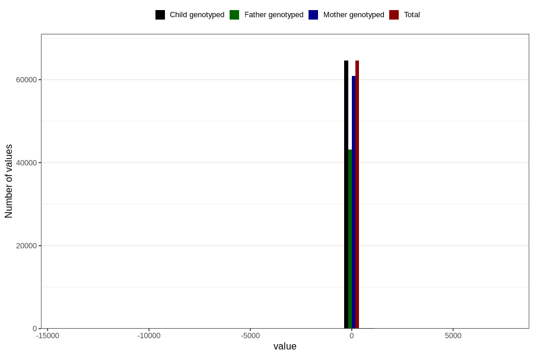

# age_6m
Variable mapping to `ALDER6MND_SJEKK` in `Skjema4_6mnd_v12`.
- Number of values:

| Value | Total | Child genotyped | Mother genotyped | Father genotyped |
| ----- | ----- | --------------- | ---------------- | ---------------- |
| Missing | 16084 | 16084 | 15015 | 9924 |
| Non-missing | 64722 | 64722 | 61009 | 43239 |
| 25th percentile | 167 | 167 | 167 | 167 |
| 50th percentile | 181 | 181 | 181 | 181 |
| 75th percentile | 187 | 187 | 187 | 187 |
| Mean | 172.684821235438 | 172.684821235438 | 172.638004228884 | 172.130992853674 |
| Standard deviation | 124.550065200691 | 124.550065200691 | 127.711234922241 | 134.67494002678 |
| N | 64722 | 64722 | 61009 | 43239 |

