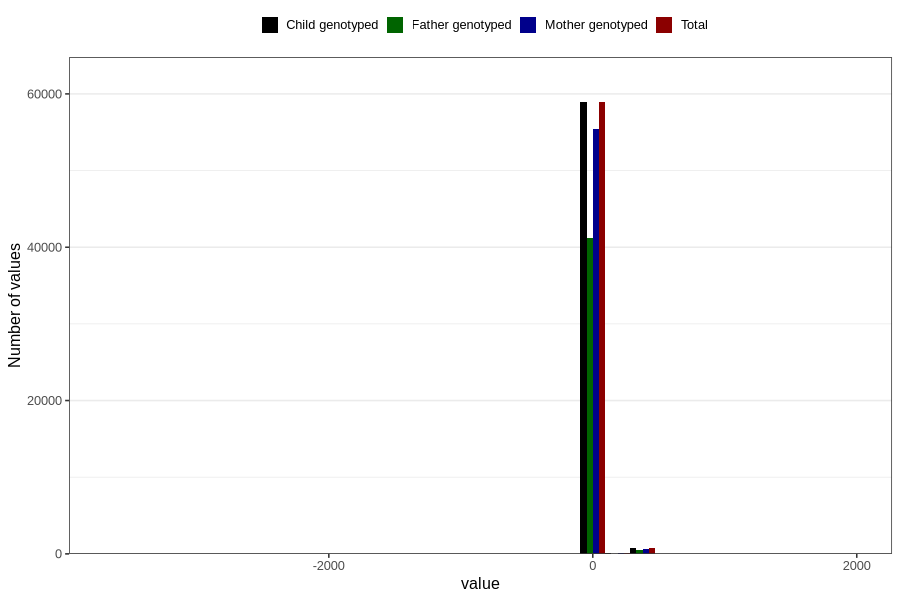

# age_6w
Variable mapping to `ALDER6UK_SJEKK` in `Skjema4_6mnd_v12`.
- Number of values:

| Value | Total | Child genotyped | Mother genotyped | Father genotyped |
| ----- | ----- | --------------- | ---------------- | ---------------- |
| Missing | 21005 | 21005 | 19808 | 11310 |
| Non-missing | 59801 | 59801 | 56216 | 41853 |
| 25th percentile | 40 | 40 | 40 | 40 |
| 50th percentile | 44 | 44 | 44 | 44 |
| 75th percentile | 48 | 48 | 48 | 48 |
| Mean | 46.7521780572231 | 46.7521780572231 | 46.7689803614629 | 46.7461113898645 |
| Standard deviation | 60.3689089837345 | 60.3689089837345 | 60.0534531305949 | 60.1584935901629 |
| N | 59801 | 59801 | 56216 | 41853 |

