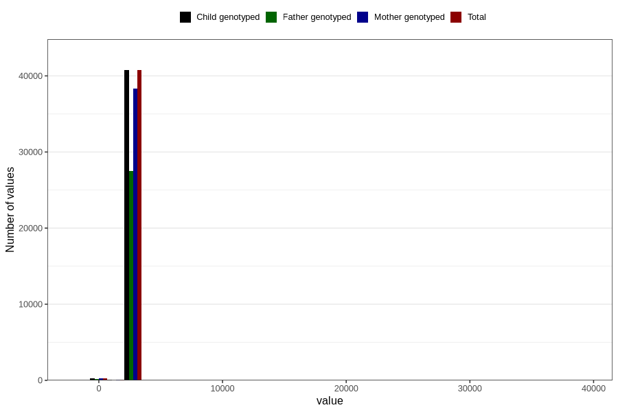

# age_7y
Variable mapping to `AGE_MTHS_Q7` in `Skjema7aar_v12`.
- Number of values:

| Value | Total | Child genotyped | Mother genotyped | Father genotyped |
| ----- | ----- | --------------- | ---------------- | ---------------- |
| Missing | 39786 | 39786 | 37395 | 25480 |
| Non-missing | 41020 | 41020 | 38629 | 27683 |
| 25th percentile | 2556.75 | 2556.75 | 2556.75 | 2556.75 |
| 50th percentile | 2587.1875 | 2587.1875 | 2587.1875 | 2587.1875 |
| 75th percentile | 2617.625 | 2617.625 | 2617.625 | 2617.625 |
| Mean | 2590.66755546075 | 2590.66755546075 | 2590.78210185353 | 2586.87414207275 |
| Standard deviation | 281.094455609716 | 281.094455609716 | 286.023176035831 | 300.992492288611 |
| N | 41020 | 41020 | 38629 | 27683 |

