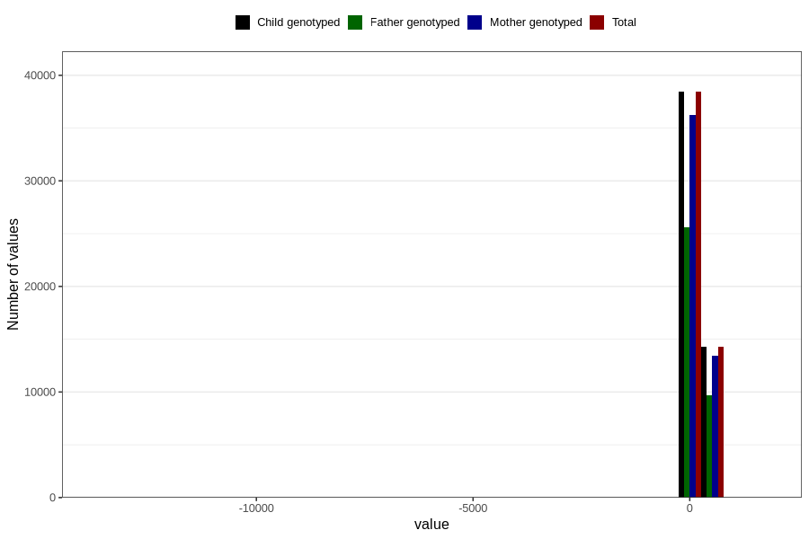

# age_8m
Variable mapping to `Q5_AGE_8_M` in `Skjema5_18mnd_v12`.
- Number of values:

| Value | Total | Child genotyped | Mother genotyped | Father genotyped |
| ----- | ----- | --------------- | ---------------- | ---------------- |
| Missing | 28099 | 28099 | 26319 | 17859 |
| Non-missing | 52707 | 52707 | 49705 | 35304 |
| 25th percentile | 234 | 234 | 234 | 234 |
| 50th percentile | 246 | 246 | 246 | 246 |
| 75th percentile | 260 | 260 | 260 | 261 |
| Mean | 249.943062591307 | 249.943062591307 | 250.043899004124 | 250.781441196465 |
| Standard deviation | 87.4419574966142 | 87.4419574966142 | 88.0727832530293 | 66.0068991303683 |
| N | 52707 | 52707 | 49705 | 35304 |

