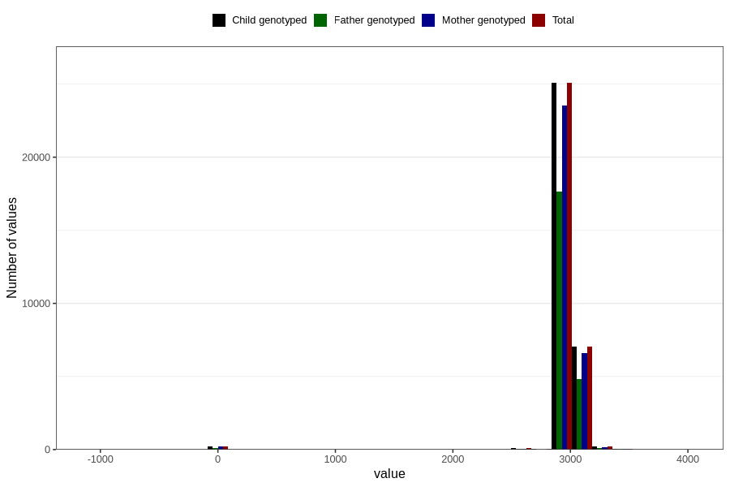

# age_8y
Variable mapping to `AGE_MTHS_Q8AAR` in `Skjema8aar_v12`.
- Number of values:

| Value | Total | Child genotyped | Mother genotyped | Father genotyped |
| ----- | ----- | --------------- | ---------------- | ---------------- |
| Missing | 48124 | 48124 | 45338 | 30283 |
| Non-missing | 32682 | 32682 | 30686 | 22880 |
| 25th percentile | 2922 | 2922 | 2922 | 2922 |
| 50th percentile | 2952.4375 | 2952.4375 | 2952.4375 | 2952.4375 |
| 75th percentile | 2982.875 | 2982.875 | 2982.875 | 2982.875 |
| Mean | 2950.56460934153 | 2950.56460934153 | 2950.20373704621 | 2952.05304031906 |
| Standard deviation | 250.561746884764 | 250.561746884764 | 252.890040894344 | 238.407423228918 |
| N | 32682 | 32682 | 30686 | 22880 |

