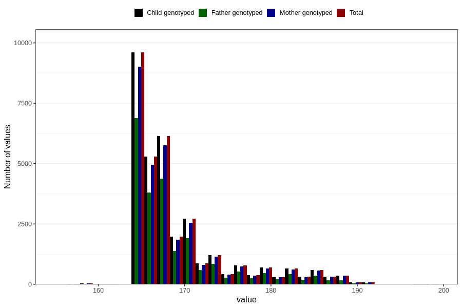

# age_answering_q_13
Variable mapping to `AGE_MTHS_KOST` in `Kosthold_ungdom_v12`.
- Number of values:

| Value | Total | Child genotyped | Mother genotyped | Father genotyped |
| ----- | ----- | --------------- | ---------------- | ---------------- |
| Missing | 47888 | 47888 | 45043 | 30185 |
| Non-missing | 32918 | 32918 | 30981 | 22978 |
| 25th percentile | 165 | 165 | 165 | 165 |
| 50th percentile | 167 | 167 | 167 | 167 |
| 75th percentile | 171 | 171 | 171 | 170 |
| Mean | 169.188650586305 | 169.188650586305 | 169.227881604855 | 168.880581425712 |
| Standard deviation | 6.07498005138737 | 6.07498005138737 | 6.11613228340636 | 5.71195056211976 |
| N | 32918 | 32918 | 30981 | 22978 |

