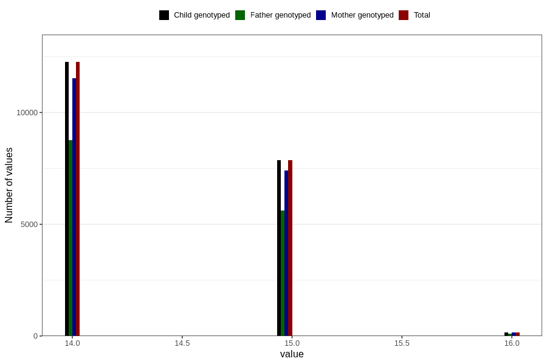

# age_answering_q_14c
Variable mapping to `AGE_YRS_UB` in `Ungdomsskjema_Barn_v12_standard`.
- Number of values:

| Value | Total | Child genotyped | Mother genotyped | Father genotyped |
| ----- | ----- | --------------- | ---------------- | ---------------- |
| Missing | 60520 | 60520 | 56922 | 38668 |
| Non-missing | 20286 | 20286 | 19102 | 14495 |
| 14 | 12257 | 12257 | 11535 | 8774 |
| 15 | 7860 | 7860 | 7412 | 5610 |
| 16 | 169 | 169 | 155 | 111 |

