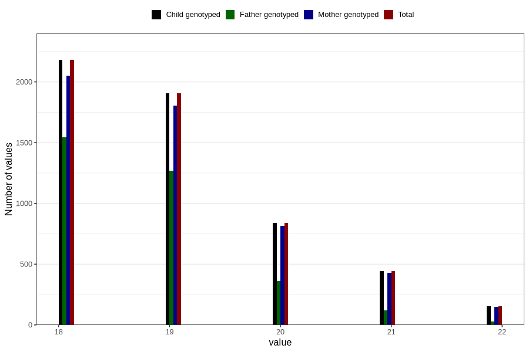

# age_answering_q_18
Variable mapping to `AGE_YRS_VE` in `18-aarsskjema_v12_standard`.
- Number of values:

| Value | Total | Child genotyped | Mother genotyped | Father genotyped |
| ----- | ----- | --------------- | ---------------- | ---------------- |
| Missing | 75284 | 75284 | 70776 | 49842 |
| Non-missing | 5522 | 5522 | 5248 | 3321 |
| 18 | 2180 | 2180 | 2053 | 1544 |
| 19 | 1906 | 1906 | 1804 | 1267 |
| 20 | 841 | 841 | 816 | 362 |
| 21 | 442 | 442 | 428 | 119 |
| 22 | 153 | 153 | 147 | 29 |

