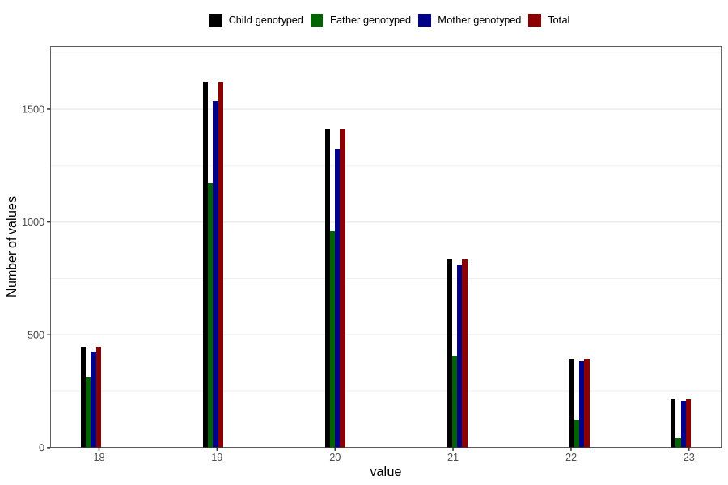

# age_answering_q_19
Variable mapping to `AGE_YRS_VG` in `19_aarsskjema_standard`.
- Number of values:

| Value | Total | Child genotyped | Mother genotyped | Father genotyped |
| ----- | ----- | --------------- | ---------------- | ---------------- |
| Missing | 75892 | 75892 | 71340 | 50150 |
| Non-missing | 4914 | 4914 | 4684 | 3013 |
| 18 | 448 | 448 | 427 | 312 |
| 19 | 1617 | 1617 | 1534 | 1169 |
| 20 | 1409 | 1409 | 1325 | 959 |
| 21 | 834 | 834 | 807 | 408 |
| 22 | 392 | 392 | 384 | 124 |
| 23 | 214 | 214 | 207 | 41 |

