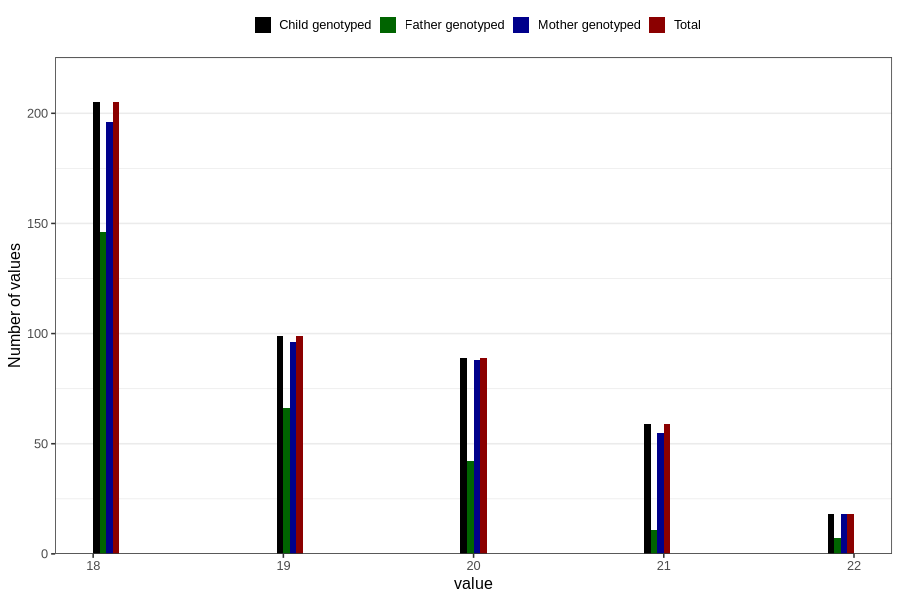

# age_answering_q_wf
Variable mapping to `AGE_YRS_WK` in `WF_Klinikkskjema_v12`.
- Number of values:

| Value | Total | Child genotyped | Mother genotyped | Father genotyped |
| ----- | ----- | --------------- | ---------------- | ---------------- |
| Missing | 80336 | 80336 | 75571 | 52891 |
| Non-missing | 470 | 470 | 453 | 272 |
| 18 | 205 | 205 | 196 | 146 |
| 19 | 99 | 99 | 96 | 66 |
| 20 | 89 | 89 | 88 | 42 |
| 21 | 59 | 59 | 55 | 11 |
| 22 | 18 | 18 | 18 | 7 |

