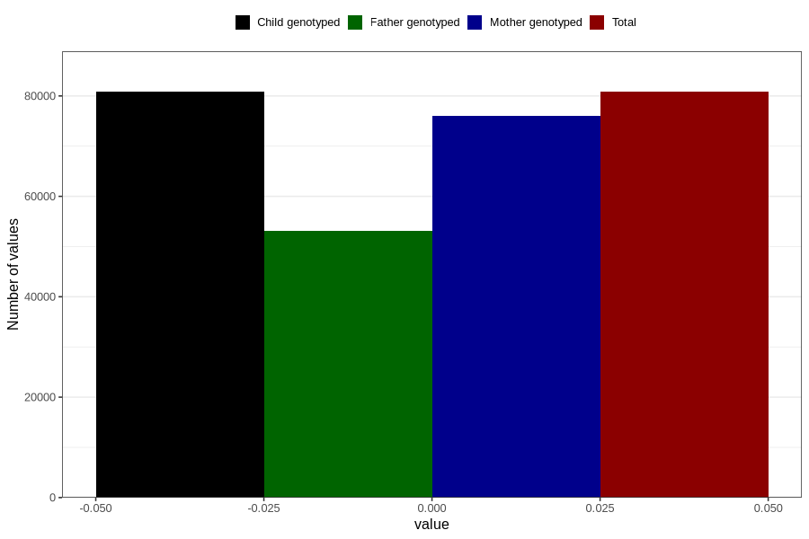

# age_birth
Variable created during phenotype curation.
- Number of values:

| Value | Total | Child genotyped | Mother genotyped | Father genotyped |
| ----- | ----- | --------------- | ---------------- | ---------------- |
| Missing | 0 | 0 | 0 | 0 |
| Non-missing | 80806 | 80806 | 76024 | 53163 |
| 0 | 80806 | 80806 | 76024 | 53163 |

