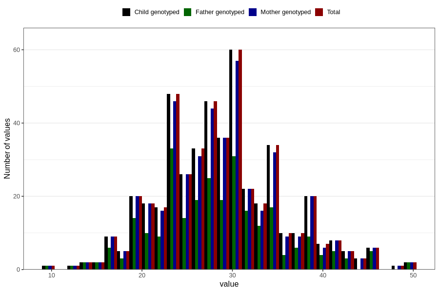

# body_fat_pct_wf
Variable mapping to `WK16` in `WF_Klinikkskjema_v12`.
- Number of values:

| Value | Total | Child genotyped | Mother genotyped | Father genotyped |
| ----- | ----- | --------------- | ---------------- | ---------------- |
| Missing | 80336 | 80336 | 75571 | 52891 |
| Non-missing | 470 | 470 | 453 | 272 |
| 25th percentile | 24 | 24 | 24 | 24 |
| 50th percentile | 29 | 29 | 29 | 28 |
| 75th percentile | 33 | 33 | 33 | 32 |
| Mean | 28.9021276595745 | 28.9021276595745 | 28.8520971302428 | 28.4669117647059 |
| Standard deviation | 6.64986298852723 | 6.64986298852723 | 6.69815231882047 | 6.89930265631805 |
| N | 470 | 470 | 453 | 272 |

