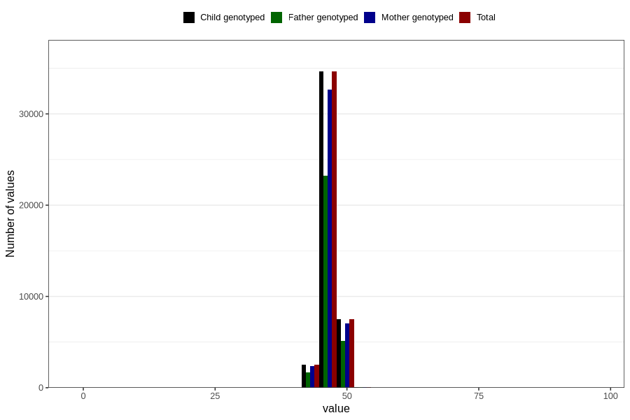

# hc_1y
Variable mapping to `EE394` in `Skjema5_18mnd_v12`.
- Number of values:

| Value | Total | Child genotyped | Mother genotyped | Father genotyped |
| ----- | ----- | --------------- | ---------------- | ---------------- |
| Missing | 36039 | 36039 | 33852 | 23074 |
| Non-missing | 44767 | 44767 | 42172 | 30089 |
| 25th percentile | 46 | 46 | 46 | 46 |
| 50th percentile | 47 | 47 | 47 | 47 |
| 75th percentile | 47.8 | 47.8 | 47.8 | 47.8 |
| Mean | 46.8491210043112 | 46.8491210043112 | 46.8491558379968 | 46.8569277809166 |
| Standard deviation | 1.58299658459123 | 1.58299658459123 | 1.58537920873513 | 1.57071056972113 |
| N | 44767 | 44767 | 42172 | 30089 |

