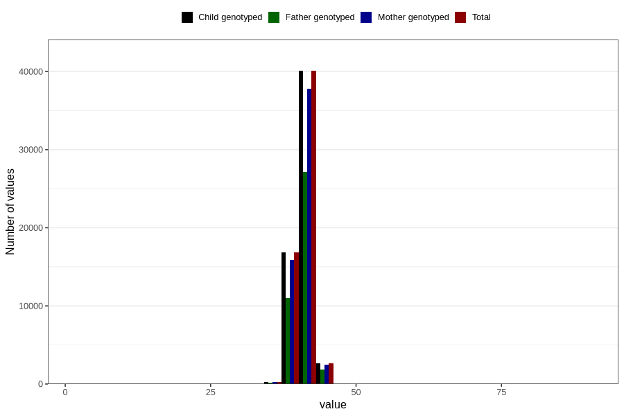

# hc_3m
Variable mapping to `DD220` in `Skjema4_6mnd_v12`.
- Number of values:

| Value | Total | Child genotyped | Mother genotyped | Father genotyped |
| ----- | ----- | --------------- | ---------------- | ---------------- |
| Missing | 20853 | 20853 | 19515 | 13033 |
| Non-missing | 59953 | 59953 | 56509 | 40130 |
| 25th percentile | 40 | 40 | 40 | 40 |
| 50th percentile | 41 | 41 | 41 | 41 |
| 75th percentile | 42 | 42 | 42 | 42 |
| Mean | 40.9703984788084 | 40.9703984788084 | 40.9699092180007 | 40.9810142038375 |
| Standard deviation | 1.38596295681371 | 1.38596295681371 | 1.38681941764582 | 1.38695345251252 |
| N | 59953 | 59953 | 56509 | 40130 |

