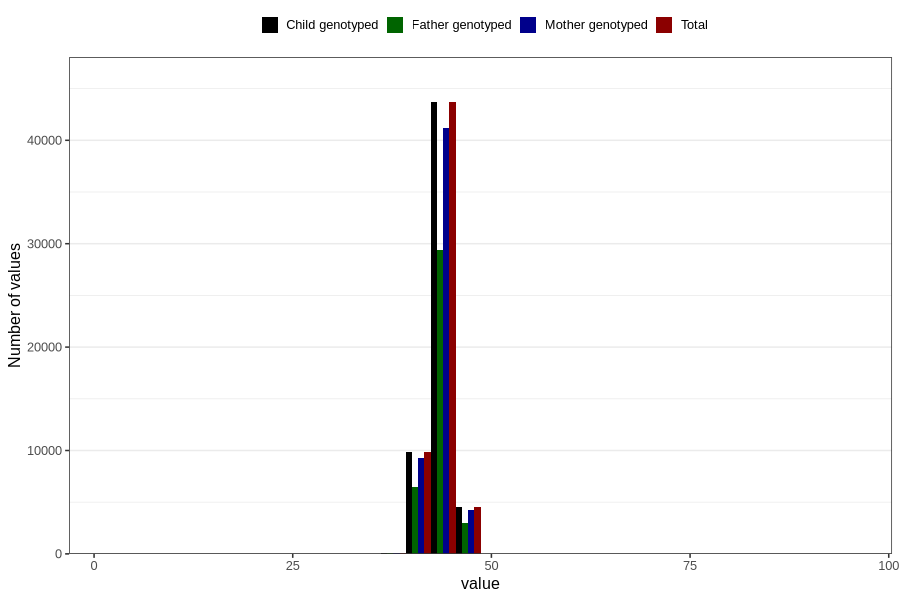

# hc_6m
Variable mapping to `DD226` in `Skjema4_6mnd_v12`.
- Number of values:

| Value | Total | Child genotyped | Mother genotyped | Father genotyped |
| ----- | ----- | --------------- | ---------------- | ---------------- |
| Missing | 22650 | 22650 | 21236 | 14213 |
| Non-missing | 58156 | 58156 | 54788 | 38950 |
| 25th percentile | 42.8 | 42.8 | 42.8 | 42.8 |
| 50th percentile | 43.6 | 43.6 | 43.6 | 43.6 |
| 75th percentile | 44.5 | 44.5 | 44.5 | 44.5 |
| Mean | 43.666123873719 | 43.666123873719 | 43.66551252099 | 43.6716405648267 |
| Standard deviation | 1.50975033333853 | 1.50975033333853 | 1.51035538164855 | 1.50850979157019 |
| N | 58156 | 58156 | 54788 | 38950 |

