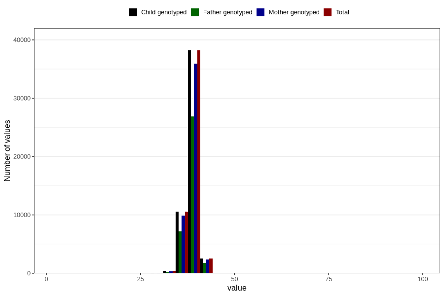

# hc_6w
Variable mapping to `DD214` in `Skjema4_6mnd_v12`.
- Number of values:

| Value | Total | Child genotyped | Mother genotyped | Father genotyped |
| ----- | ----- | --------------- | ---------------- | ---------------- |
| Missing | 29120 | 29120 | 27449 | 17036 |
| Non-missing | 51686 | 51686 | 48575 | 36127 |
| 25th percentile | 37.9 | 37.9 | 37.9 | 38 |
| 50th percentile | 38.7 | 38.7 | 38.7 | 38.7 |
| 75th percentile | 39.5 | 39.5 | 39.5 | 39.5 |
| Mean | 38.6339472971404 | 38.6339472971404 | 38.6325352547607 | 38.6420765632352 |
| Standard deviation | 1.49610992188862 | 1.49610992188862 | 1.49574024432113 | 1.51663558845628 |
| N | 51686 | 51686 | 48575 | 36127 |

