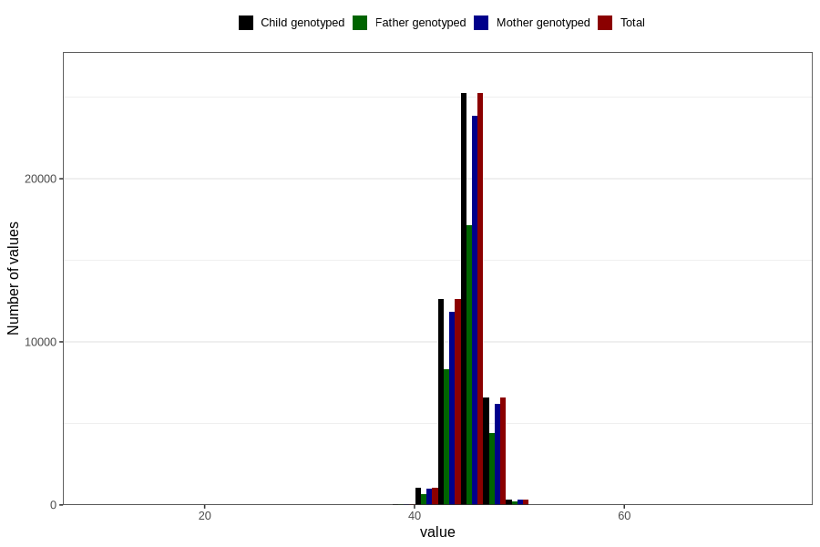

# hc_8m
Variable mapping to `EE388` in `Skjema5_18mnd_v12`.
- Number of values:

| Value | Total | Child genotyped | Mother genotyped | Father genotyped |
| ----- | ----- | --------------- | ---------------- | ---------------- |
| Missing | 34871 | 34871 | 32725 | 22284 |
| Non-missing | 45935 | 45935 | 43299 | 30879 |
| 25th percentile | 44 | 44 | 44 | 44 |
| 50th percentile | 45 | 45 | 45 | 45 |
| 75th percentile | 46 | 46 | 46 | 46 |
| Mean | 45.1149363230652 | 45.1149363230652 | 45.1171135592046 | 45.1279380808964 |
| Standard deviation | 1.51346233987074 | 1.51346233987074 | 1.51517947160875 | 1.50634115127352 |
| N | 45935 | 45935 | 43299 | 30879 |

