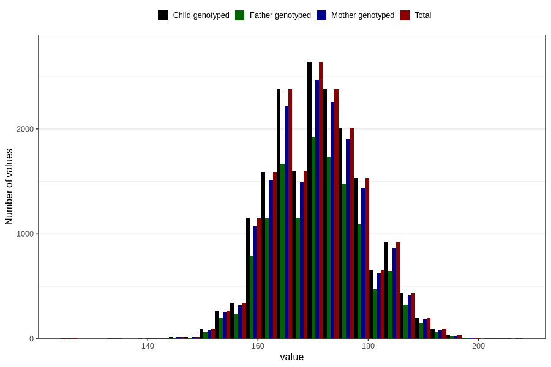

# height_14c
Variable mapping to `UB220` in `Ungdomsskjema_Barn_v12_standard`.
- Number of values:

| Value | Total | Child genotyped | Mother genotyped | Father genotyped |
| ----- | ----- | --------------- | ---------------- | ---------------- |
| Missing | 62412 | 62412 | 58719 | 39932 |
| Non-missing | 18394 | 18394 | 17305 | 13231 |
| 25th percentile | 165 | 165 | 165 | 165 |
| 50th percentile | 170 | 170 | 170 | 170 |
| 75th percentile | 176 | 176 | 176 | 176 |
| Mean | 170.800967706861 | 170.800967706861 | 170.800751227969 | 170.875368452876 |
| Standard deviation | 8.35625622142491 | 8.35625622142491 | 8.3465417406721 | 8.32164932640306 |
| N | 18394 | 18394 | 17305 | 13231 |

