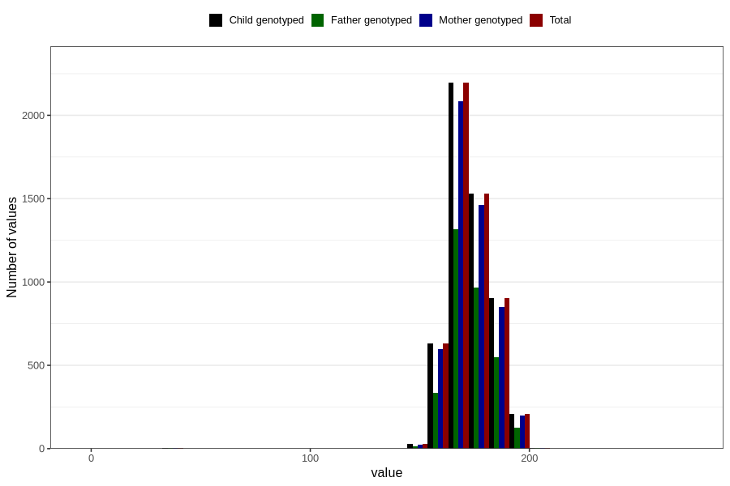

# height_18
Variable mapping to `VE43` in `18-aarsskjema_v12_standard`.
- Number of values:

| Value | Total | Child genotyped | Mother genotyped | Father genotyped |
| ----- | ----- | --------------- | ---------------- | ---------------- |
| Missing | 75300 | 75300 | 70791 | 49851 |
| Non-missing | 5506 | 5506 | 5233 | 3312 |
| 25th percentile | 166 | 166 | 166 | 167 |
| 50th percentile | 172 | 172 | 172 | 172 |
| 75th percentile | 180 | 180 | 180 | 180 |
| Mean | 172.818924809299 | 172.818924809299 | 172.830498757883 | 173.233695652174 |
| Standard deviation | 10.8320551306431 | 10.8320551306431 | 10.8936569057172 | 10.4221542192574 |
| N | 5506 | 5506 | 5233 | 3312 |

