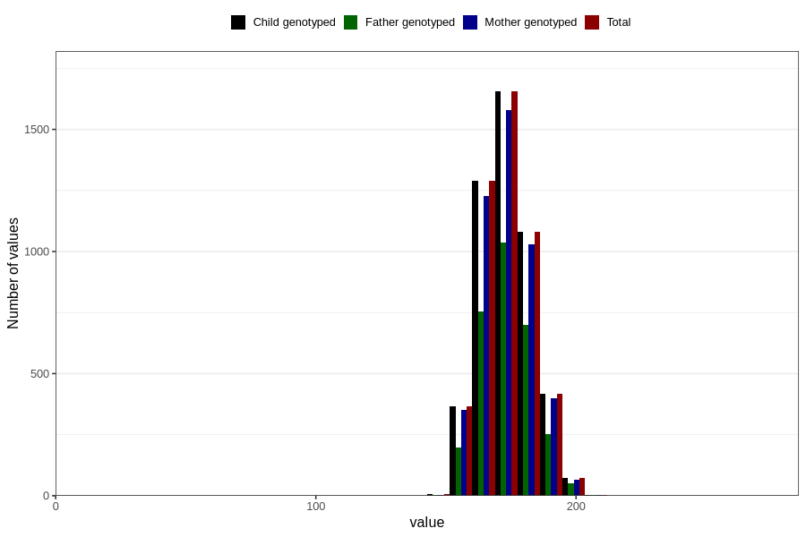

# height_19
Variable mapping to `VG134` in `19_aarsskjema_standard`.
- Number of values:

| Value | Total | Child genotyped | Mother genotyped | Father genotyped |
| ----- | ----- | --------------- | ---------------- | ---------------- |
| Missing | 75913 | 75913 | 71360 | 50163 |
| Non-missing | 4893 | 4893 | 4664 | 3000 |
| 25th percentile | 166 | 166 | 166 | 167 |
| 50th percentile | 172 | 172 | 172 | 173 |
| 75th percentile | 180 | 180 | 180 | 180 |
| Mean | 173.262415695892 | 173.262415695892 | 173.233276157804 | 173.529333333333 |
| Standard deviation | 9.91176380791156 | 9.91176380791156 | 9.92277921769026 | 9.99929004926777 |
| N | 4893 | 4893 | 4664 | 3000 |

