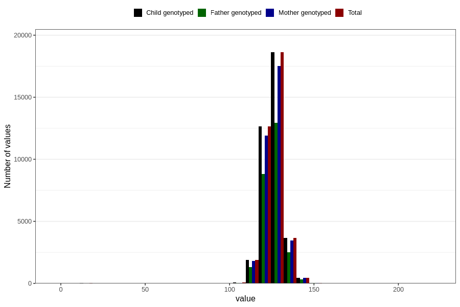

# height_7y_cm
Variable mapping to `JJ408` in `Skjema7aar_v12`.
- Number of values:

| Value | Total | Child genotyped | Mother genotyped | Father genotyped |
| ----- | ----- | --------------- | ---------------- | ---------------- |
| Missing | 43380 | 43380 | 40806 | 27162 |
| Non-missing | 37426 | 37426 | 35218 | 26001 |
| 25th percentile | 122 | 122 | 122 | 122 |
| 50th percentile | 126 | 126 | 126 | 126 |
| 75th percentile | 130 | 130 | 130 | 130 |
| Mean | 125.895366857265 | 125.895366857265 | 125.909165767505 | 125.884235221722 |
| Standard deviation | 6.68005387322435 | 6.68005387322435 | 6.56906236266381 | 6.49730579671707 |
| N | 37426 | 37426 | 35218 | 26001 |

