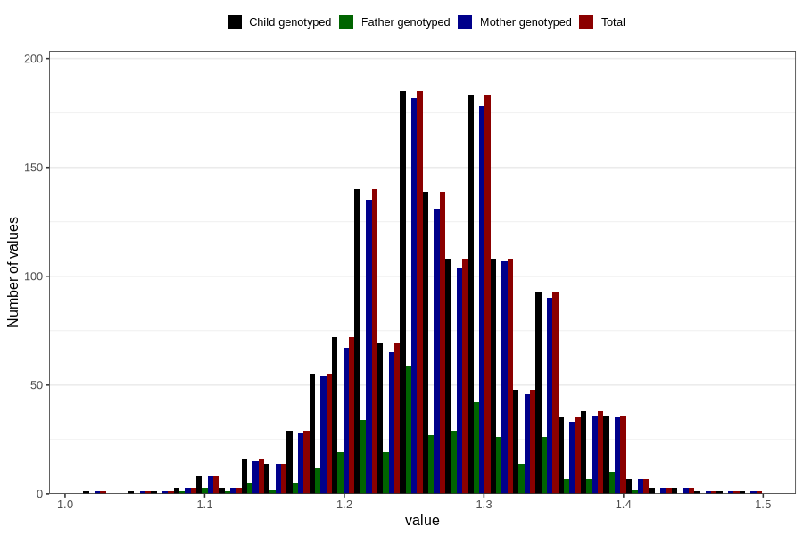

# height_7y_m
Variable mapping to `JJ324` in `Skjema7aar_v12`.
- Number of values:

| Value | Total | Child genotyped | Mother genotyped | Father genotyped |
| ----- | ----- | --------------- | ---------------- | ---------------- |
| Missing | 79405 | 79405 | 74671 | 52813 |
| Non-missing | 1401 | 1401 | 1353 | 350 |
| 25th percentile | 1.23 | 1.23 | 1.23 | 1.23 |
| 50th percentile | 1.27 | 1.27 | 1.27 | 1.26 |
| 75th percentile | 1.31 | 1.31 | 1.31 | 1.31 |
| Mean | 1.26995717344754 | 1.26995717344754 | 1.27005912786401 | 1.26857142857143 |
| Standard deviation | 0.0628626474966702 | 0.0628626474966702 | 0.0629677483296981 | 0.0605771126241964 |
| N | 1401 | 1401 | 1353 | 350 |

