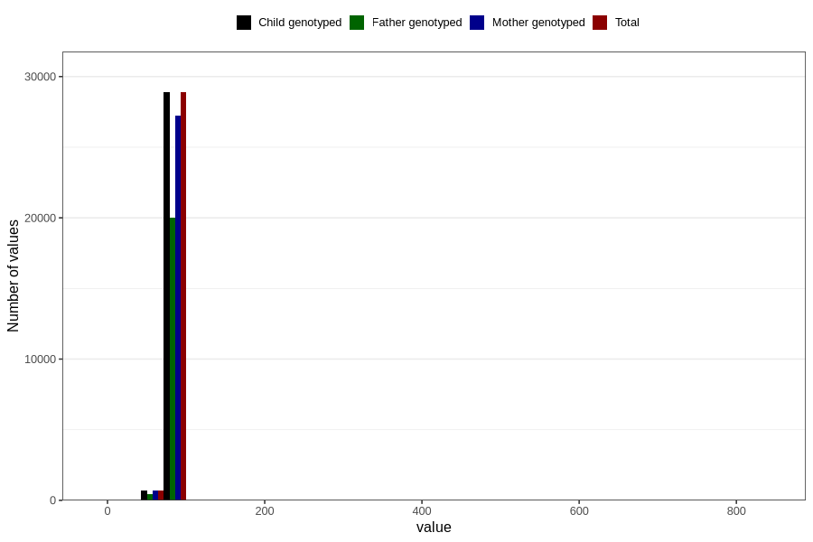

# length_15_18m_2
Variable mapping to `GG15` in `Skjema6_3aar_v12`.
- Number of values:

| Value | Total | Child genotyped | Mother genotyped | Father genotyped |
| ----- | ----- | --------------- | ---------------- | ---------------- |
| Missing | 51205 | 51205 | 48113 | 32660 |
| Non-missing | 29601 | 29601 | 27911 | 20503 |
| 25th percentile | 78.5 | 78.5 | 78.5 | 78.2 |
| 50th percentile | 80.5 | 80.5 | 80.5 | 80.5 |
| 75th percentile | 83 | 83 | 83 | 83 |
| Mean | 80.5372487415966 | 80.5372487415966 | 80.5100032245351 | 80.5203775057309 |
| Standard deviation | 8.40263124317019 | 8.40263124317019 | 7.33173634498048 | 8.49666017544923 |
| N | 29601 | 29601 | 27911 | 20503 |

