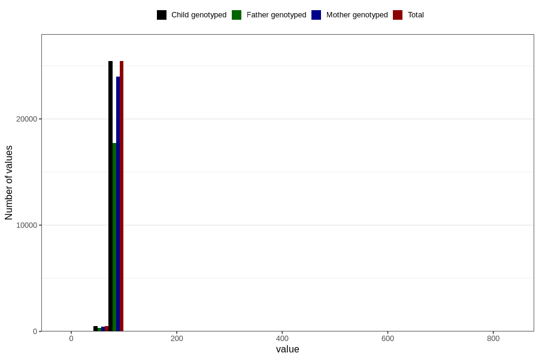

# length_16m
Variable created during phenotype curation.
- Number of values:

| Value | Total | Child genotyped | Mother genotyped | Father genotyped |
| ----- | ----- | --------------- | ---------------- | ---------------- |
| Missing | 54870 | 54870 | 51556 | 35123 |
| Non-missing | 25936 | 25936 | 24468 | 18040 |
| 25th percentile | 78.5 | 78.5 | 78.5 | 78.5 |
| 50th percentile | 80.5 | 80.5 | 80.5 | 80.5 |
| 75th percentile | 83 | 83 | 83 | 83 |
| Mean | 80.5541987970389 | 80.5541987970389 | 80.5246812162825 | 80.5214467849224 |
| Standard deviation | 7.43584377285231 | 7.43584377285231 | 5.89353217891058 | 6.86762963758316 |
| N | 25936 | 25936 | 24468 | 18040 |

