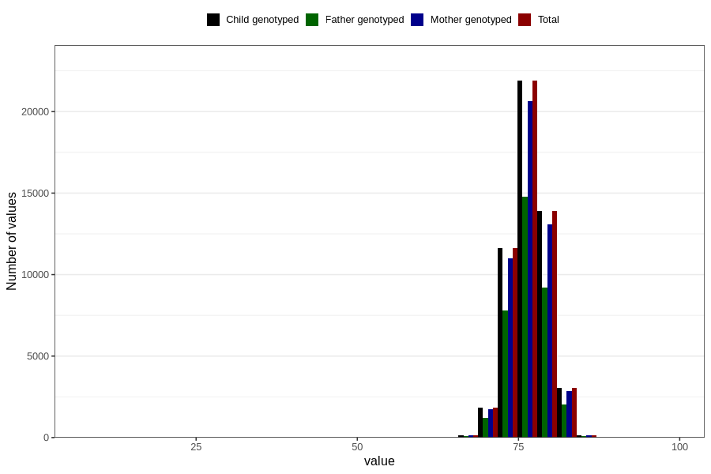

# length_1y
Variable mapping to `EE393` in `Skjema5_18mnd_v12`.
- Number of values:

| Value | Total | Child genotyped | Mother genotyped | Father genotyped |
| ----- | ----- | --------------- | ---------------- | ---------------- |
| Missing | 28233 | 28233 | 26462 | 17951 |
| Non-missing | 52573 | 52573 | 49562 | 35212 |
| 25th percentile | 74.5 | 74.5 | 74.5 | 74.5 |
| 50th percentile | 76.5 | 76.5 | 76.5 | 76.5 |
| 75th percentile | 78 | 78 | 78 | 78 |
| Mean | 76.44008141061 | 76.44008141061 | 76.4372644364634 | 76.4423009201409 |
| Standard deviation | 2.79885120498255 | 2.79885120498255 | 2.79731647222474 | 2.77815025667073 |
| N | 52573 | 52573 | 49562 | 35212 |

