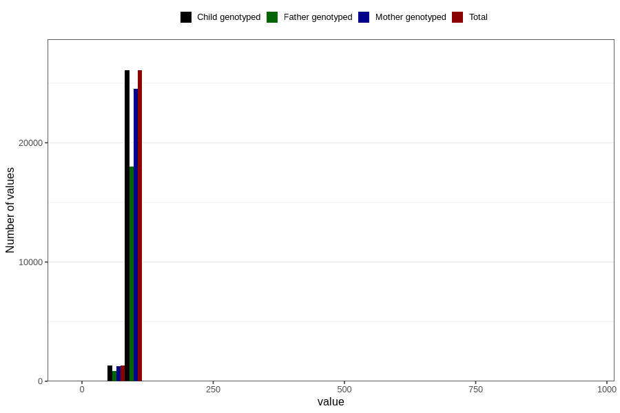

# length_2y
Variable mapping to `GG20` in `Skjema6_3aar_v12`.
- Number of values:

| Value | Total | Child genotyped | Mother genotyped | Father genotyped |
| ----- | ----- | --------------- | ---------------- | ---------------- |
| Missing | 53408 | 53408 | 50208 | 34248 |
| Non-missing | 27398 | 27398 | 25816 | 18915 |
| 25th percentile | 86 | 86 | 86 | 86 |
| 50th percentile | 88.5 | 88.5 | 88.5 | 88.5 |
| 75th percentile | 91 | 91 | 91 | 91 |
| Mean | 88.4814402511132 | 88.4814402511132 | 88.4739851255036 | 88.4961512027491 |
| Standard deviation | 9.23902140147035 | 9.23902140147035 | 9.46824884222541 | 9.43650379542778 |
| N | 27398 | 27398 | 25816 | 18915 |

