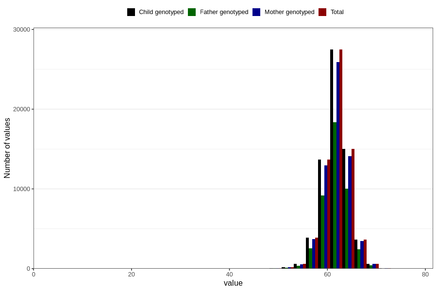

# length_3m
Variable mapping to `DD219` in `Skjema4_6mnd_v12`.
- Number of values:

| Value | Total | Child genotyped | Mother genotyped | Father genotyped |
| ----- | ----- | --------------- | ---------------- | ---------------- |
| Missing | 15601 | 15601 | 14545 | 9664 |
| Non-missing | 65205 | 65205 | 61479 | 43499 |
| 25th percentile | 60.5 | 60.5 | 60.5 | 60.5 |
| 50th percentile | 62 | 62 | 62 | 62 |
| 75th percentile | 63.8 | 63.8 | 63.6 | 63.5 |
| Mean | 61.9816593819492 | 61.9816593819492 | 61.9792303062834 | 61.9862042805582 |
| Standard deviation | 2.58741532442769 | 2.58741532442769 | 2.58509306562534 | 2.56200881568694 |
| N | 65205 | 65205 | 61479 | 43499 |

