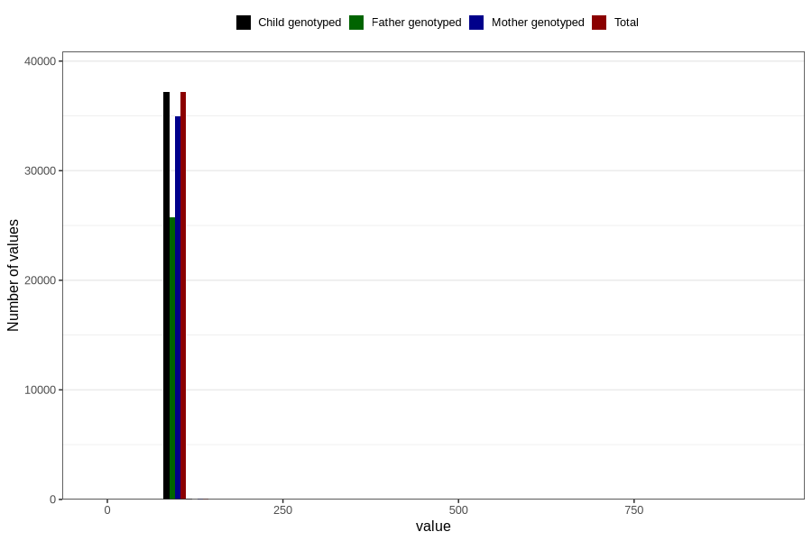

# length_3y
Variable mapping to `GG25` in `Skjema6_3aar_v12`.
- Number of values:

| Value | Total | Child genotyped | Mother genotyped | Father genotyped |
| ----- | ----- | --------------- | ---------------- | ---------------- |
| Missing | 43541 | 43541 | 40966 | 27323 |
| Non-missing | 37265 | 37265 | 35058 | 25840 |
| 25th percentile | 94 | 94 | 94 | 94 |
| 50th percentile | 97 | 97 | 97 | 97 |
| 75th percentile | 99 | 99 | 99 | 99 |
| Mean | 96.6594445189856 | 96.6594445189856 | 96.6550744480575 | 96.6620356037152 |
| Standard deviation | 6.36282184133782 | 6.36282184133782 | 6.45617550817096 | 6.92436276344867 |
| N | 37265 | 37265 | 35058 | 25840 |

