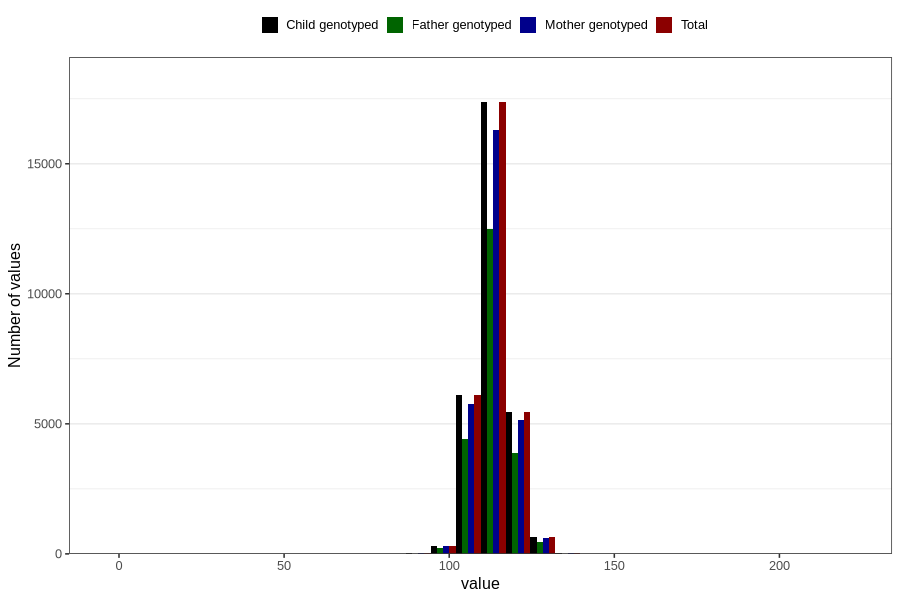

# length_5y
Variable mapping to `LL12` in `Skjema5aar_v12`.
- Number of values:

| Value | Total | Child genotyped | Mother genotyped | Father genotyped |
| ----- | ----- | --------------- | ---------------- | ---------------- |
| Missing | 50819 | 50819 | 47844 | 31650 |
| Non-missing | 29987 | 29987 | 28180 | 21513 |
| 25th percentile | 110 | 110 | 110 | 110 |
| 50th percentile | 113 | 113 | 113 | 113 |
| 75th percentile | 117 | 117 | 117 | 116 |
| Mean | 113.202487744689 | 113.202487744689 | 113.209723207949 | 113.188304745968 |
| Standard deviation | 6.22295923045304 | 6.22295923045304 | 6.25589763502256 | 6.23430784782784 |
| N | 29987 | 29987 | 28180 | 21513 |

