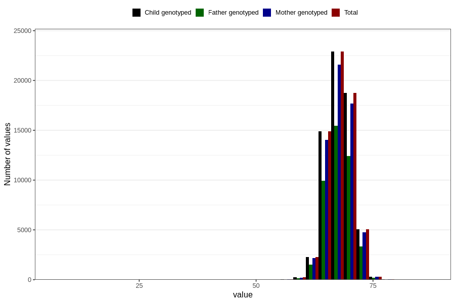

# length_6m
Variable mapping to `DD225` in `Skjema4_6mnd_v12`.
- Number of values:

| Value | Total | Child genotyped | Mother genotyped | Father genotyped |
| ----- | ----- | --------------- | ---------------- | ---------------- |
| Missing | 16277 | 16277 | 15188 | 10103 |
| Non-missing | 64529 | 64529 | 60836 | 43060 |
| 25th percentile | 66 | 66 | 66 | 66 |
| 50th percentile | 68 | 68 | 68 | 68 |
| 75th percentile | 69.5 | 69.5 | 69.5 | 69.5 |
| Mean | 67.83900726805 | 67.83900726805 | 67.8365605891249 | 67.8296098467255 |
| Standard deviation | 2.60832670973812 | 2.60832670973812 | 2.60692587080901 | 2.57931029987001 |
| N | 64529 | 64529 | 60836 | 43060 |

