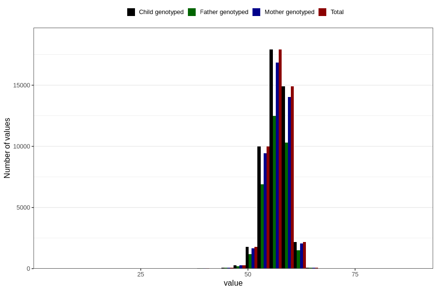

# length_6w
Variable mapping to `DD213` in `Skjema4_6mnd_v12`.
- Number of values:

| Value | Total | Child genotyped | Mother genotyped | Father genotyped |
| ----- | ----- | --------------- | ---------------- | ---------------- |
| Missing | 33506 | 33506 | 31517 | 20397 |
| Non-missing | 47300 | 47300 | 44507 | 32766 |
| 25th percentile | 55 | 55 | 55 | 55 |
| 50th percentile | 57 | 57 | 57 | 57 |
| 75th percentile | 58.5 | 58.5 | 58.5 | 58.5 |
| Mean | 56.7418625792812 | 56.7418625792812 | 56.7402138989372 | 56.7532381126778 |
| Standard deviation | 2.61607925160637 | 2.61607925160637 | 2.61334650361465 | 2.5805602212669 |
| N | 47300 | 47300 | 44507 | 32766 |

