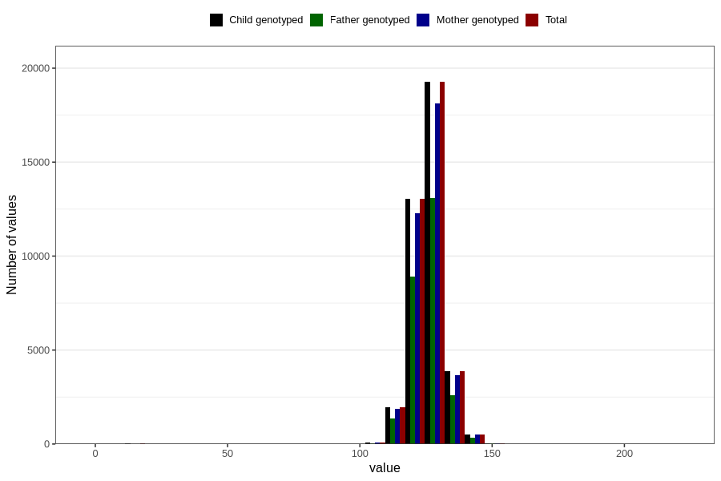

# length_7y
Variable created during phenotype curation.
- Number of values:

| Value | Total | Child genotyped | Mother genotyped | Father genotyped |
| ----- | ----- | --------------- | ---------------- | ---------------- |
| Missing | 41979 | 41979 | 39453 | 26812 |
| Non-missing | 38827 | 38827 | 36571 | 26351 |
| 25th percentile | 122 | 122 | 122 | 122 |
| 50th percentile | 126 | 126 | 126 | 126 |
| 75th percentile | 130 | 130 | 130 | 130 |
| Mean | 125.935070955778 | 125.935070955778 | 125.949741598534 | 125.897157603127 |
| Standard deviation | 6.66933054852394 | 6.66933054852394 | 6.56237321985559 | 6.49251005367984 |
| N | 38827 | 38827 | 36571 | 26351 |

