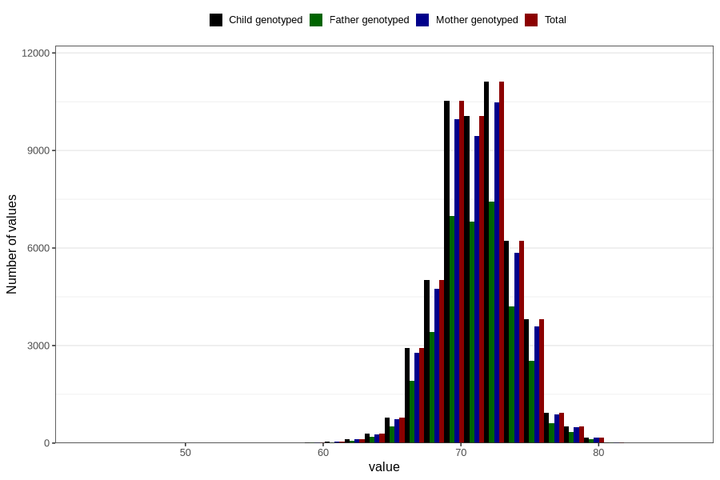

# length_8m
Variable mapping to `EE387` in `Skjema5_18mnd_v12`.
- Number of values:

| Value | Total | Child genotyped | Mother genotyped | Father genotyped |
| ----- | ----- | --------------- | ---------------- | ---------------- |
| Missing | 28184 | 28184 | 26405 | 17938 |
| Non-missing | 52622 | 52622 | 49619 | 35225 |
| 25th percentile | 69.5 | 69.5 | 69.5 | 69.5 |
| 50th percentile | 71 | 71 | 71 | 71 |
| 75th percentile | 73 | 73 | 73 | 73 |
| Mean | 71.2012789327658 | 71.2012789327658 | 71.1969709183982 | 71.2081561391058 |
| Standard deviation | 2.81457310809412 | 2.81457310809412 | 2.8114824142244 | 2.78606809192126 |
| N | 52622 | 52622 | 49619 | 35225 |

