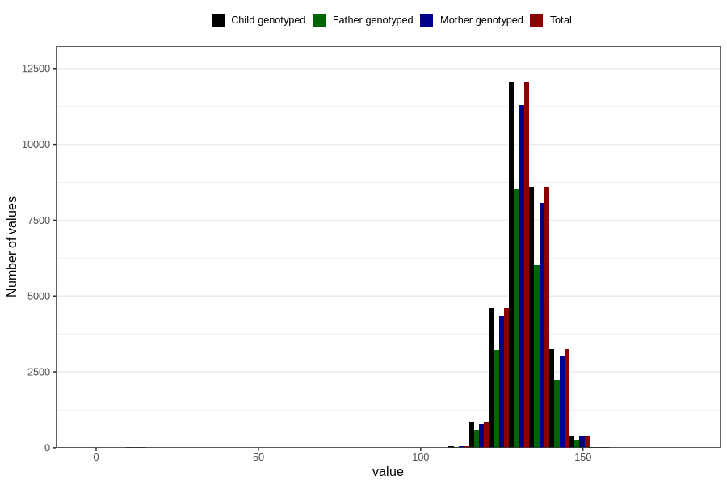

# length_8y
Variable mapping to `NN24` in `Skjema8aar_v12`.
- Number of values:

| Value | Total | Child genotyped | Mother genotyped | Father genotyped |
| ----- | ----- | --------------- | ---------------- | ---------------- |
| Missing | 51007 | 51007 | 48037 | 32245 |
| Non-missing | 29799 | 29799 | 27987 | 20918 |
| 25th percentile | 128 | 128 | 128 | 128 |
| 50th percentile | 132 | 132 | 132 | 132 |
| 75th percentile | 136 | 136 | 136 | 136 |
| Mean | 132.100271821202 | 132.100271821202 | 132.090542037374 | 132.108758007458 |
| Standard deviation | 6.5993122725969 | 6.5993122725969 | 6.64612389710099 | 6.43705321082288 |
| N | 29799 | 29799 | 27987 | 20918 |

