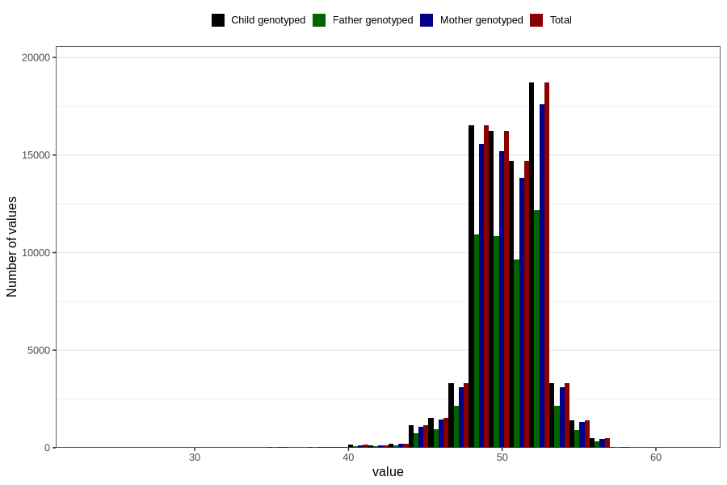

# length_birth
Variable mapping to `LENGDE` in `MFR_541_v12`.
Variable mapping to `LENGDE` in `MFR_541_v12`.
- Number of values:

| Value | Total | Child genotyped | Mother genotyped | Father genotyped |
| ----- | ----- | --------------- | ---------------- | ---------------- |
| Missing | 2844 | 2844 | 2682 | 1920 |
| Non-missing | 77962 | 77962 | 73342 | 51243 |
| 25th percentile | 49 | 49 | 49 | 49 |
| 50th percentile | 50 | 50 | 50 | 50 |
| 75th percentile | 52 | 52 | 52 | 52 |
| Mean | 50.4159590569765 | 50.4159590569765 | 50.4153418232391 | 50.4133832913764 |
| Standard deviation | 2.24414416008999 | 2.24414416008999 | 2.246370314743 | 2.23434931991218 |
| N | 77962 | 77962 | 73342 | 51243 |

