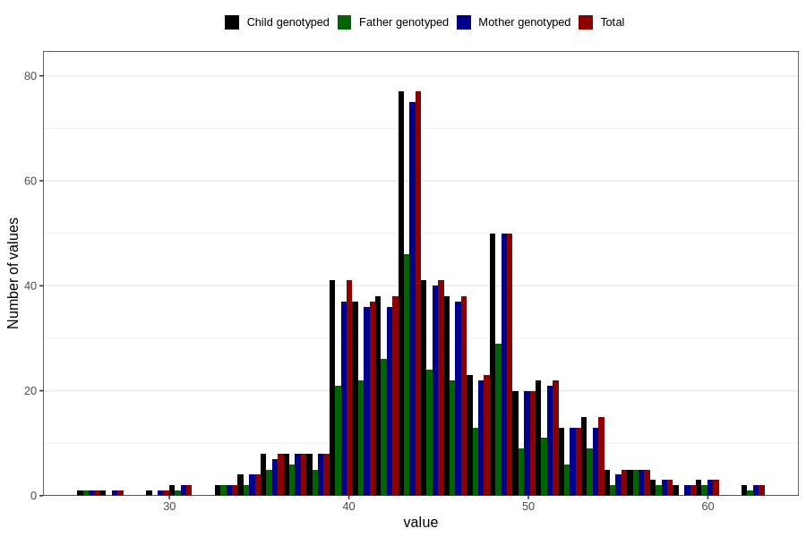

# muscle_mass_kg_wf
Variable mapping to `WK18` in `WF_Klinikkskjema_v12`.
- Number of values:

| Value | Total | Child genotyped | Mother genotyped | Father genotyped |
| ----- | ----- | --------------- | ---------------- | ---------------- |
| Missing | 80336 | 80336 | 75571 | 52891 |
| Non-missing | 470 | 470 | 453 | 272 |
| 25th percentile | 42 | 42 | 42 | 42 |
| 50th percentile | 45 | 45 | 45 | 44 |
| 75th percentile | 48 | 48 | 48 | 48 |
| Mean | 45.036170212766 | 45.036170212766 | 45.0529801324503 | 44.8713235294118 |
| Standard deviation | 5.21568593358019 | 5.21568593358019 | 5.20821519137726 | 5.15962766596583 |
| N | 470 | 470 | 453 | 272 |

