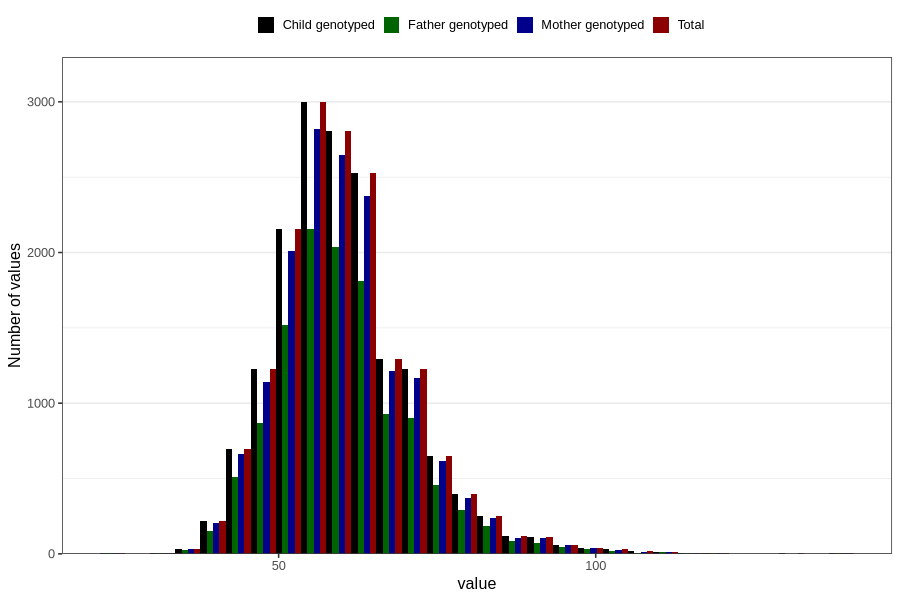

# weight_14c
Variable mapping to `UB221` in `Ungdomsskjema_Barn_v12_standard`.
- Number of values:

| Value | Total | Child genotyped | Mother genotyped | Father genotyped |
| ----- | ----- | --------------- | ---------------- | ---------------- |
| Missing | 63888 | 63888 | 60113 | 41018 |
| Non-missing | 16918 | 16918 | 15911 | 12145 |
| 25th percentile | 53 | 53 | 53 | 53 |
| 50th percentile | 59 | 59 | 59 | 59 |
| 75th percentile | 66 | 66 | 66 | 66 |
| Mean | 60.3515190920913 | 60.3515190920913 | 60.3462384513858 | 60.3314121037464 |
| Standard deviation | 10.9704674734326 | 10.9704674734326 | 10.9352863941069 | 10.881219793443 |
| N | 16918 | 16918 | 15911 | 12145 |

