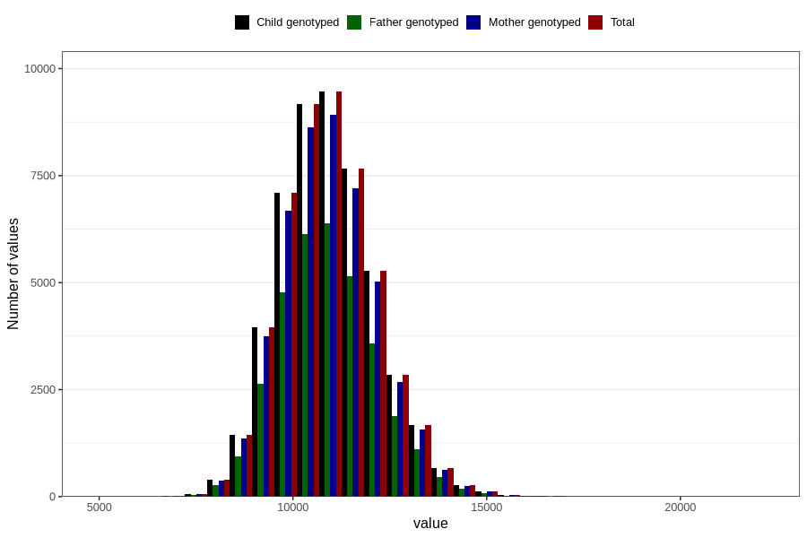

# weight_15_18m_1
Variable mapping to `EE398` in `Skjema5_18mnd_v12`.
- Number of values:

| Value | Total | Child genotyped | Mother genotyped | Father genotyped |
| ----- | ----- | --------------- | ---------------- | ---------------- |
| Missing | 30614 | 30614 | 28705 | 19477 |
| Non-missing | 50192 | 50192 | 47319 | 33686 |
| 25th percentile | 10060 | 10060 | 10060 | 10065.25 |
| 50th percentile | 10860 | 10860 | 10860 | 10860 |
| 75th percentile | 11700 | 11700 | 11700 | 11700 |
| Mean | 10924.8674091489 | 10924.8674091489 | 10923.734313912 | 10925.5113400226 |
| Standard deviation | 1219.37599196425 | 1219.37599196425 | 1219.55656400639 | 1214.61158413573 |
| N | 50192 | 50192 | 47319 | 33686 |

