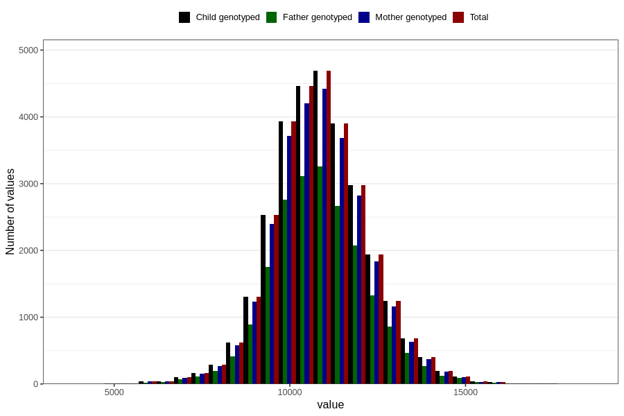

# weight_15_18m_2
Variable mapping to `GG16` in `Skjema6_3aar_v12`.
- Number of values:

| Value | Total | Child genotyped | Mother genotyped | Father genotyped |
| ----- | ----- | --------------- | ---------------- | ---------------- |
| Missing | 51064 | 51064 | 47976 | 32563 |
| Non-missing | 29742 | 29742 | 28048 | 20600 |
| 25th percentile | 10000 | 10000 | 10000 | 10000 |
| 50th percentile | 10800 | 10800 | 10800 | 10800 |
| 75th percentile | 11700 | 11700 | 11700 | 11700 |
| Mean | 10860.8850110954 | 10860.8850110954 | 10859.0420707359 | 10861.2365048544 |
| Standard deviation | 1362.79083750017 | 1362.79083750017 | 1358.89502061595 | 1360.14179606774 |
| N | 29742 | 29742 | 28048 | 20600 |

