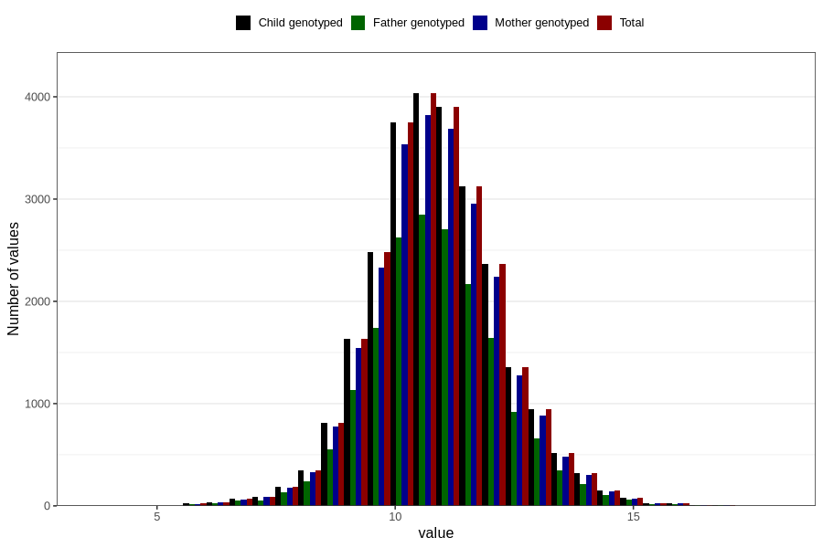

# weight_16m
Variable created during phenotype curation.
- Number of values:

| Value | Total | Child genotyped | Mother genotyped | Father genotyped |
| ----- | ----- | --------------- | ---------------- | ---------------- |
| Missing | 54509 | 54509 | 51208 | 34875 |
| Non-missing | 26297 | 26297 | 24816 | 18288 |
| 25th percentile | 10 | 10 | 10 | 10 |
| 50th percentile | 10.81 | 10.81 | 10.81 | 10.8 |
| 75th percentile | 11.7 | 11.7 | 11.7 | 11.7 |
| Mean | 10.8700082138647 | 10.8700082138647 | 10.8685713249516 | 10.8689775262467 |
| Standard deviation | 1.34816500383169 | 1.34816500383169 | 1.34483644163719 | 1.34481931767736 |
| N | 26297 | 26297 | 24816 | 18288 |

