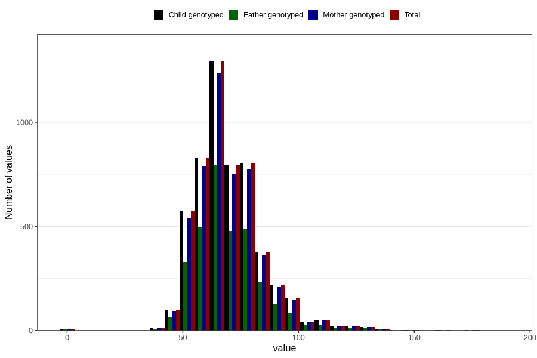

# weight_18
Variable mapping to `VE44` in `18-aarsskjema_v12_standard`.
- Number of values:

| Value | Total | Child genotyped | Mother genotyped | Father genotyped |
| ----- | ----- | --------------- | ---------------- | ---------------- |
| Missing | 75460 | 75460 | 70936 | 49947 |
| Non-missing | 5346 | 5346 | 5088 | 3216 |
| 25th percentile | 60 | 60 | 60 | 60 |
| 50th percentile | 68 | 68 | 68 | 68 |
| 75th percentile | 77 | 77 | 77 | 77 |
| Mean | 70.0796857463524 | 70.0796857463524 | 70.0678066037736 | 69.9791666666667 |
| Standard deviation | 15.0491185429247 | 15.0491185429247 | 14.9045030797605 | 14.7751378345539 |
| N | 5346 | 5346 | 5088 | 3216 |

