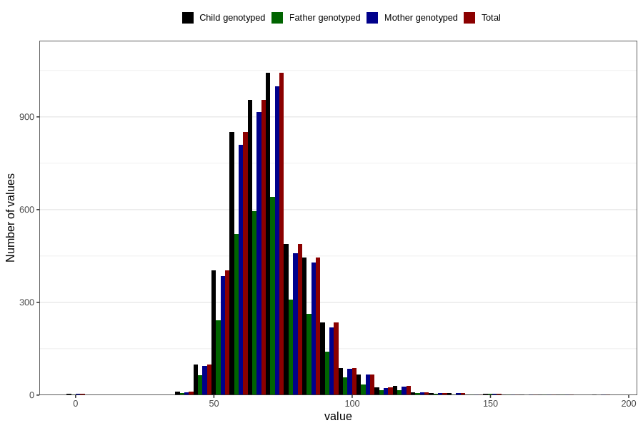

# weight_19
Variable mapping to `VG135` in `19_aarsskjema_standard`.
- Number of values:

| Value | Total | Child genotyped | Mother genotyped | Father genotyped |
| ----- | ----- | --------------- | ---------------- | ---------------- |
| Missing | 76022 | 76022 | 71461 | 50228 |
| Non-missing | 4784 | 4784 | 4563 | 2935 |
| 25th percentile | 61 | 61 | 61 | 61 |
| 50th percentile | 69 | 69 | 69 | 69 |
| 75th percentile | 79 | 79 | 79 | 78 |
| Mean | 71.0094063545151 | 71.0094063545151 | 70.9927679158448 | 70.8977853492334 |
| Standard deviation | 14.8257040461119 | 14.8257040461119 | 14.8175278725456 | 14.6065104822433 |
| N | 4784 | 4784 | 4563 | 2935 |

