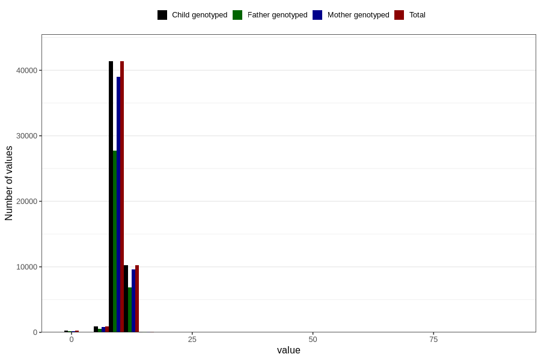

# weight_1y
Variable mapping to `EE392` in `Skjema5_18mnd_v12`.
- Number of values:

| Value | Total | Child genotyped | Mother genotyped | Father genotyped |
| ----- | ----- | --------------- | ---------------- | ---------------- |
| Missing | 28072 | 28072 | 26310 | 17849 |
| Non-missing | 52734 | 52734 | 49714 | 35314 |
| 25th percentile | 9.15 | 9.15 | 9.15 | 9.16 |
| 50th percentile | 9.88 | 9.88 | 9.88 | 9.885 |
| 75th percentile | 10.64375 | 10.64375 | 10.645 | 10.64 |
| Mean | 9.90484759358289 | 9.90484759358289 | 9.90490260288852 | 9.90825579090446 |
| Standard deviation | 1.30745380085743 | 1.30745380085743 | 1.30768850331439 | 1.32146868779923 |
| N | 52734 | 52734 | 49714 | 35314 |

