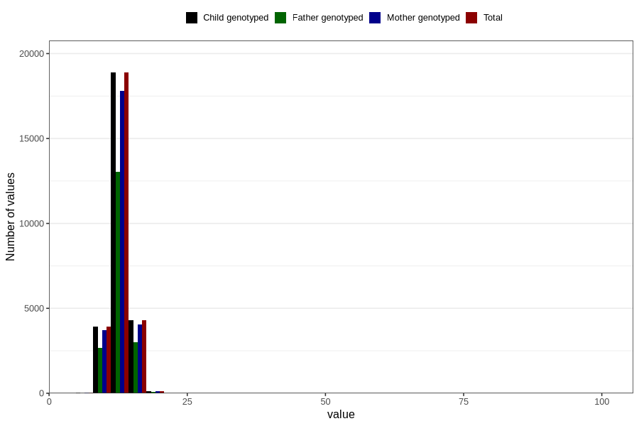

# weight_2y
Variable mapping to `GG21` in `Skjema6_3aar_v12`.
- Number of values:

| Value | Total | Child genotyped | Mother genotyped | Father genotyped |
| ----- | ----- | --------------- | ---------------- | ---------------- |
| Missing | 53543 | 53543 | 50326 | 34352 |
| Non-missing | 27263 | 27263 | 25698 | 18811 |
| 25th percentile | 11.9 | 11.9 | 11.9 | 11.9 |
| 50th percentile | 12.9 | 12.9 | 12.9 | 12.9 |
| 75th percentile | 14 | 14 | 14 | 14 |
| Mean | 12.9149723067894 | 12.9149723067894 | 12.9139578955561 | 12.9290968050609 |
| Standard deviation | 1.99280484183244 | 1.99280484183244 | 2.01567605551856 | 2.01173986281434 |
| N | 27263 | 27263 | 25698 | 18811 |

