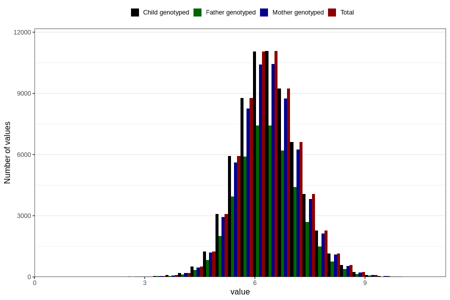

# weight_3m
Variable mapping to `DD218` in `Skjema4_6mnd_v12`.
- Number of values:

| Value | Total | Child genotyped | Mother genotyped | Father genotyped |
| ----- | ----- | --------------- | ---------------- | ---------------- |
| Missing | 14403 | 14403 | 13421 | 8849 |
| Non-missing | 66403 | 66403 | 62603 | 44314 |
| 25th percentile | 5.825 | 5.825 | 5.82 | 5.83 |
| 50th percentile | 6.35 | 6.35 | 6.35 | 6.35 |
| 75th percentile | 6.9 | 6.9 | 6.9 | 6.9 |
| Mean | 6.3768294655362 | 6.3768294655362 | 6.37573581138284 | 6.37592171774157 |
| Standard deviation | 0.831085849119563 | 0.831085849119563 | 0.830064811149897 | 0.825090884423607 |
| N | 66403 | 66403 | 62603 | 44314 |

