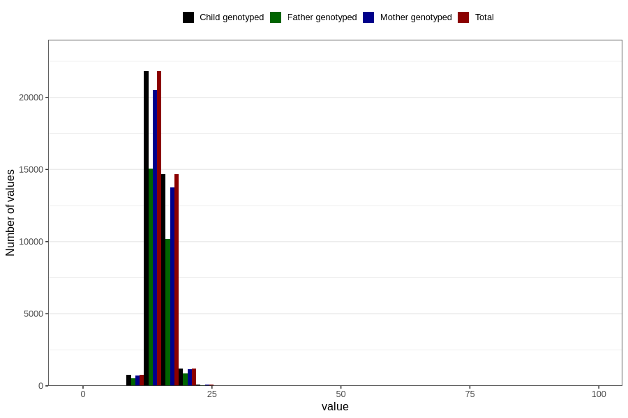

# weight_3y
Variable mapping to `GG26` in `Skjema6_3aar_v12`.
- Number of values:

| Value | Total | Child genotyped | Mother genotyped | Father genotyped |
| ----- | ----- | --------------- | ---------------- | ---------------- |
| Missing | 42251 | 42251 | 39780 | 26470 |
| Non-missing | 38555 | 38555 | 36244 | 26693 |
| 25th percentile | 14 | 14 | 14 | 14 |
| 50th percentile | 15 | 15 | 15 | 15 |
| 75th percentile | 16 | 16 | 16 | 16 |
| Mean | 15.0613961872649 | 15.0613961872649 | 15.0600725637347 | 15.0683860937324 |
| Standard deviation | 1.8951768310143 | 1.8951768310143 | 1.89810648708808 | 1.85488819690637 |
| N | 38555 | 38555 | 36244 | 26693 |

